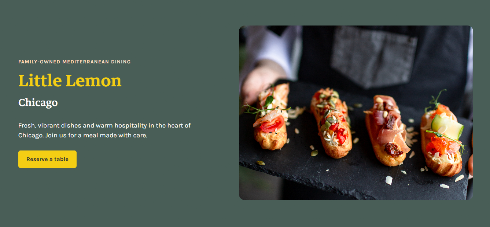
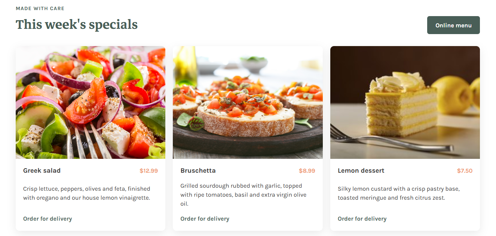
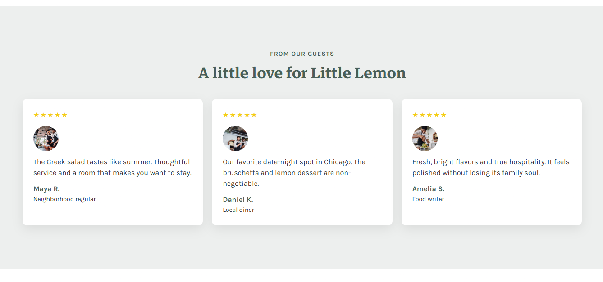
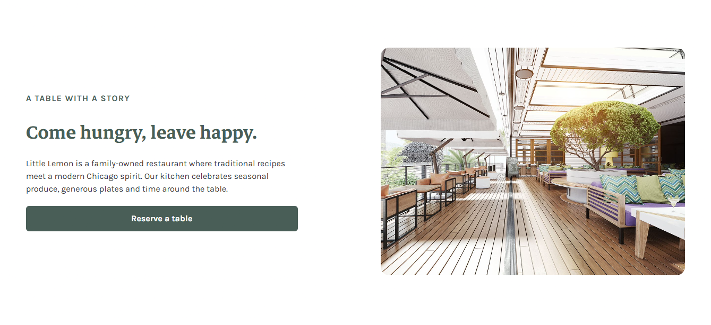
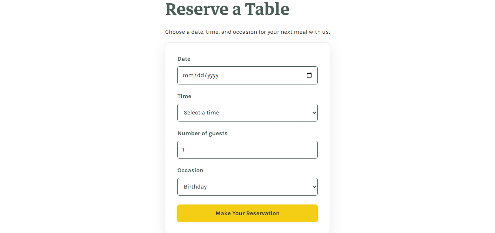

# Little Lemon — Table Booking Web App

A responsive React web application for **Little Lemon**, a fictional Mediterranean restaurant in Chicago. This project was created as the final capstone project for the **Meta Front-End Developer Professional Certificate**.

The application allows users to explore the restaurant website and make a table reservation through an interactive booking form.

## 🌐 Live Demo

[View the Live Website](https://little-lemon-capstone-amber.vercel.app/)

## 📸 Screenshots

### Home Page






### Reservation Page



## 📂 Project Overview

The project was built using **React** and focuses on creating a functional, accessible, responsive, and user-friendly restaurant website.

The application includes:

* Home page
* About page
* Menu page
* Reservations page
* Online ordering page
* Login page
* Booking confirmation page
* Responsive navigation
* Table reservation form
* Form validation
* Available booking times based on the selected date
* Booking API integration
* Accessibility improvements
* Unit tests

## 🎯 Features

### 🍋 Restaurant Website

The website provides several pages for exploring Little Lemon:

* **Home** — Restaurant introduction, specials, customer reviews, and information about the restaurant.
* **About** — Information about Little Lemon and its restaurant experience.
* **Menu** — Different food and drink categories with descriptions and prices.
* **Reservations** — Interactive table booking form.
* **Order Online** — Restaurant ordering interface.
* **Login** — Demo login interface.
* **Confirmed Booking** — Confirmation page displayed after a successful reservation.

### 📅 Table Reservation

Users can make a reservation by selecting:

* Date
* Available time
* Number of guests
* Occasion

The booking form uses controlled React components and React state.

### ✅ Form Validation

The reservation form includes:

* HTML5 validation
* Required fields
* Guest number validation
* Client-side validation
* Disabled submit button when the form is invalid

### 🔌 API Integration

The application uses the provided Little Lemon API to:

* Retrieve available reservation times
* Update available times when the selected date changes
* Submit reservation information

### ♿ Accessibility

Accessibility was considered throughout the application using:

* Semantic HTML
* Proper form labels
* `htmlFor` and `id` relationships
* Appropriate ARIA attributes
* Keyboard-friendly interactive elements

### 🧪 Unit Testing

The project includes unit tests using:

* Jest
* React Testing Library

Tests cover important functionality including:

* React components
* Booking form behavior
* Initial available booking times
* Updated booking times
* API-related functionality
* Form validation

## 🛠️ Technologies Used

* React
* JavaScript
* HTML5
* CSS3
* React Router
* React Testing Library
* Jest
* Node.js
* npm
* Git
* GitHub

## 📁 Project Structure

```text
little-lemon-capstone/
│
├── public/
│   ├── icons_assets/
│   ├── api.js
│   └── index.html
│
├── src/
│   ├── App.js
│   ├── App.css
│   ├── Header.js
│   ├── Nav.js
│   ├── Main.js
│   ├── Footer.js
│   ├── Homepage.js
│   ├── CallToAction.js
│   ├── Specials.js
│   ├── CustomersSay.js
│   ├── Chicago.js
│   ├── BookingPage.js
│   ├── BookingForm.js
│   ├── ConfirmedBooking.js
│   ├── Main.test.js
│   ├── BookingForm.test.js
│   └── setupTests.js
│
├── package.json
└── README.md
```

## 🚀 Getting Started

### Prerequisites

Make sure you have the following installed:

* Node.js
* npm
* Git

### Installation

Clone the repository:

```bash
git clone https://github.com/hagarniazi/little-lemon-capstone.git
```

Navigate to the project folder:

```bash
cd little-lemon-capstone
```

Install the dependencies:

```bash
npm install
```

## ▶️ Run the Application

Start the development server:

```bash
npm start
```

The application will open in your browser at:

```text
http://localhost:3000
```

If port 3000 is already in use, React may automatically use another available port.

## 🧪 Run Tests

To run the test suite:

```bash
npm test
```

To run the tests without watch mode:

```bash
npm test -- --watchAll=false
```

## 📱 Responsive Design

The application was designed to provide a responsive experience across different screen sizes, including:

* Desktop
* Tablet
* Mobile

CSS Grid, Flexbox, responsive layouts, and media queries were used where appropriate.

## 🎨 UX/UI Design

The project follows the Little Lemon brand style and incorporates the UX/UI principles studied throughout the Meta Front-End Developer Professional Certificate.

The design focuses on:

* Clear visual hierarchy
* Consistent typography
* Responsive layouts
* Accessible forms
* Easy navigation
* Clear calls to action
* User-friendly booking interactions

## 🔄 Booking Flow

The reservation process follows these steps:

1. The user opens the **Reservations** page.
2. The user selects a date.
3. Available reservation times are loaded for the selected date.
4. The user selects a time.
5. The user enters the number of guests.
6. The user selects an occasion.
7. The form validates the entered information.
8. The user submits the reservation.
9. The booking API processes the submission.
10. The user is redirected to the **Confirmed Booking** page.

## 🔀 Git & Version Control

Git was used throughout the project to track development progress and manage the project repository.

The project is hosted on GitHub:

[Little Lemon Capstone Repository](https://github.com/hagarniazi/little-lemon-capstone?utm_source=chatgpt.com)

## 🎓 Course

This project was completed as part of:

**Meta Front-End Developer Professional Certificate**

**Course 8 — Front-End Developer Capstone**

The project demonstrates the application of skills learned throughout the certificate, including:

* HTML and CSS
* JavaScript
* React
* Responsive web development
* UX/UI principles
* Accessibility
* Forms and validation
* State management
* API integration
* Unit testing
* Git and GitHub

## 👩‍💻 Author

**Hagar Niazi**

GitHub:
[@hagarniazi](https://github.com/hagarniazi?utm_source=chatgpt.com)

LinkedIn:
[Hagar Niazi on LinkedIn](https://www.linkedin.com/in/hagar-khaled-niazi?utm_source=chatgpt.com)

## 📜 Certificate

This project was completed as part of the **Meta Front-End Developer Professional Certificate** program on Coursera.
